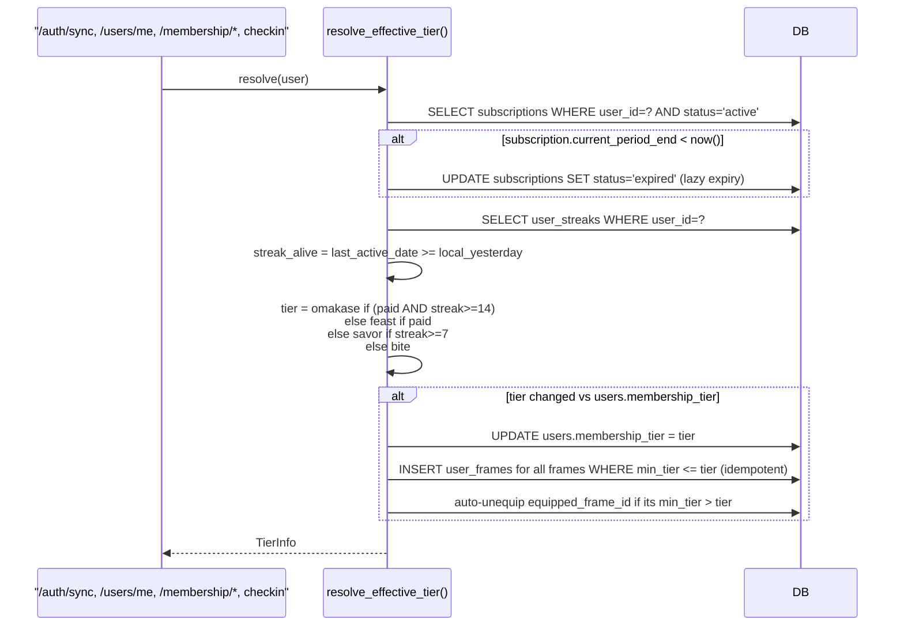
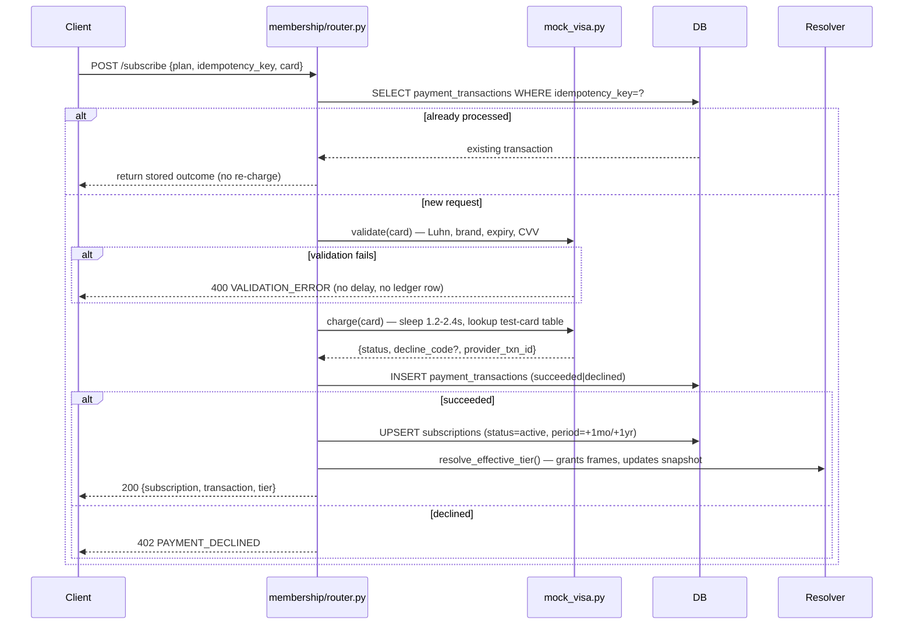
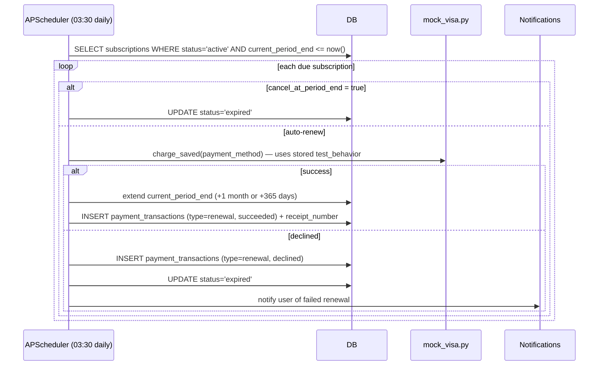

# 💳 Membership & Monetization Flow

This document details the business logic for TasteMap's 4-tier membership system (`bite` → `savor` → `feast` → `omakase`), the mock Visa checkout, quota enforcement, and avatar frame grants. Static schema/endpoint reference: [`docs/database_schema/monetization.md`](../database_schema/monetization.md) and [`docs/api/monetization.md`](../api/monetization.md).

## 1. Tier Resolution (`membership/entitlements.py::resolve_effective_tier`)

Tier is **computed on every read**, not stored authoritatively — the only durable facts are the subscription row and the streak counter. `users.membership_tier` is a denormalized snapshot written back whenever this function runs.

**Truth table:**

| Paid (active sub) | Streak ≥ 14 | Streak ≥ 7 | Effective tier |
|---|---|---|---|
| ✓ | ✓ | – | `omakase` |
| ✓ | ✗ | – | `feast` |
| ✗ | – | ✓ | `savor` |
| ✗ | – | ✗ | `bite` |

Demotion (streak break while Omakase → Feast; subscription expiry → Savor/Bite) falls out of this table automatically — there is no separate "demotion" code path.

## 2. Mock Visa Checkout (`membership/mock_visa.py`, `POST /membership/subscribe`)

**Test-card table** (Stripe-style, see `docs/api/monetization.md` for the full list): `4242 4242 4242 4242` always succeeds; `4000 0000 0000 0002` / `…9995` / `…0069` / `…0127` / `…0119` deterministically decline with a specific `decline_code`. Any other Luhn-valid Visa number succeeds. This lets the demo show every UI state (success, each decline reason) on command.

**Idempotency:** `idempotency_key` is a client-generated UUID sent once per checkout attempt. Network retries (e.g. a timeout on the client side) resend the same key and get the original result — never a second charge.

## 3. Renewal Sweep (`tasks/subscription_renewal.py`)

Cloned from the existing `tasks/interaction_cleanup.py` APScheduler pattern, scheduled at 03:30 daily (after the 03:00 interaction cleanup).

Between sweep runs, `resolve_effective_tier()`'s lazy expiry check (§1) covers any subscription whose `current_period_end` has already passed — so tier correctness never depends on the cron having run recently.

## 4. Streak Freeze (`challenges/streak_service.py::checkin`, extended)

When a check-in finds the streak broken (`last_active_date` is exactly 2 local days ago — i.e. exactly one day was missed), the service checks the caller's tier-based monthly freeze allowance (`entitlements.py`) against `COUNT(streak_freezes) WHERE user_id=? AND frozen_date >= <first of local month>`. If an allowance remains, it inserts a `streak_freezes` row for the missed date and **continues** the streak (`current_streak += 1`) instead of resetting it to 1, returning `freeze_used: true` in the check-in response. Missing more than one consecutive day still resets the streak — freezes forgive a single missed day, not extended absence.

## 5. Quota Enforcement (`membership/quota.py`)

`enforce_quota(feature)` is a FastAPI dependency factory wired onto `interactions` (swipe-batch), `culture` (all 3 endpoints), `recommendations`, and `tours` (optimize). It resolves the caller's tier (Redis-cached 60s), looks up the per-tier limit from the entitlement matrix, and — if not unlimited — does `INCR quota:{feature}:{user_id}:{local_date}` + `EXPIRE`. Over limit → 429 `QUOTA_EXCEEDED`. Structural caps (tour stops, saved tours, vault bookmarks) are plain count checks inside the relevant services rather than Redis counters, since they cap total state, not a daily rate.

**Fail-open policy:** any Redis error (including the dev-mode `InMemoryRedis` fallback lacking a method) allows the request through rather than 500ing — quota enforcement must never be the reason a demo breaks.
